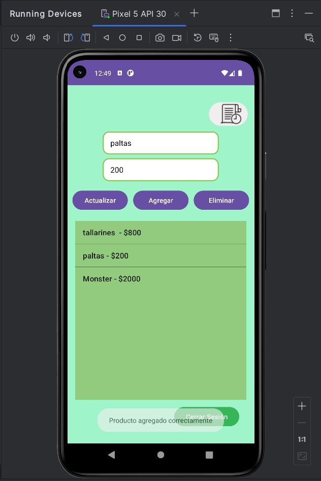
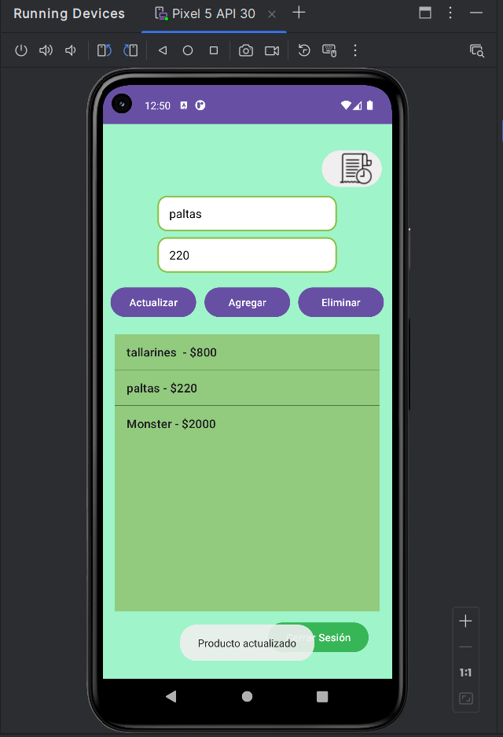
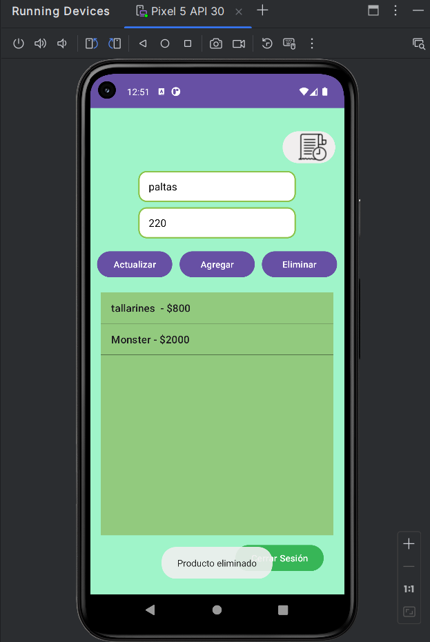
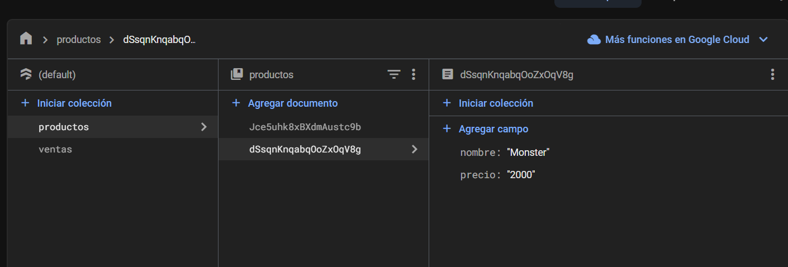
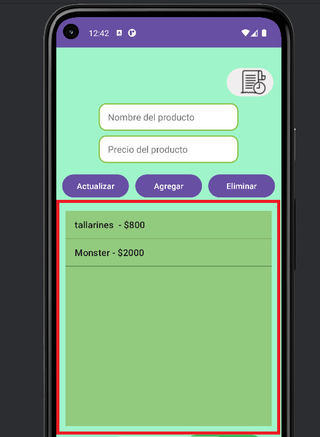
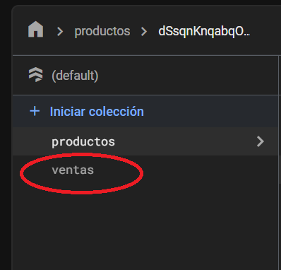
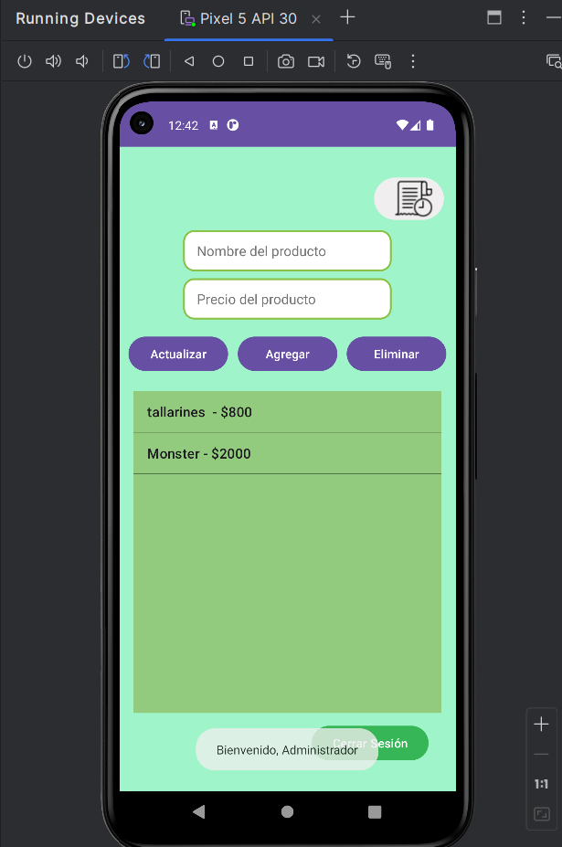
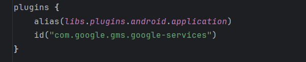
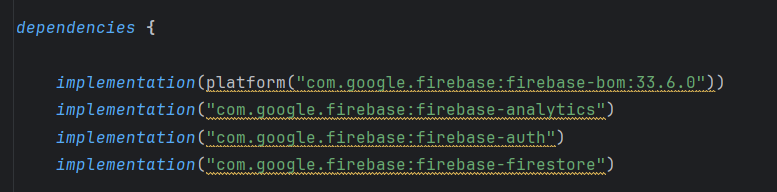
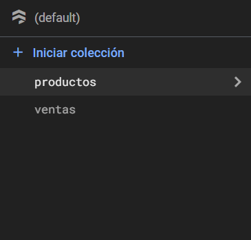

# **Proyecto IoT con Firebase y MQTT**

Este proyecto implementa una aplicación Android conectada a Firebase y un bróker MQTT para gestionar productos, ventas, y mensajes en tiempo real. A continuación, se describen las características principales, requisitos, y pasos de configuración.

---

## **Características Principales**

1. **Gestión de Productos:**
   - Formulario para agregar, actualizar y eliminar productos.
     
   #### **Agregar Producto**
      Formulario para añadir nuevos productos al sistema.
      

   #### **Actualizar Producto**
   Interfaz para modificar los datos de un producto existente.
      

   #### **Eliminar Producto**
   Pantalla que muestra cómo eliminar un producto.
      
      
   - Los productos se almacenan en una base de datos externa en Firebase Firestore.
      
     
   - Visualización en tiempo real de los productos en un `ListView`.
      

2. **Historial de Ventas:**
   - Los productos comprados se almacenan en Firestore como ventas.
     
     
   - Visualización de un historial en el `AdminMenuActivity`.
     

3. **Conexión a un Bróker MQTT:**
   - Envío de mensajes desde un formulario en la aplicación a un bróker MQTT.
   - Recepción y visualización de mensajes desde el bróker.

4. **Firebase Integration:**
   - Conexión al servicio Firestore para gestionar los datos de productos y ventas.
   
   
   - datos productos y ventas.
   
---

## **Requisitos del Sistema**
- Android Studio 2022 o superior.
- Dependencias incluidas:
  - Firebase Firestore.
  - Eclipse Paho MQTT.
- Conexión a internet para interactuar con Firebase y el bróker MQTT.

---

## **Configuración**
### **1. Configuración de Firebase**
1. Crear un proyecto en [Firebase Console](https://console.firebase.google.com/).
2. Configurar Firestore Database:
   - Crear una colección llamada `productos`.
   - Crear una colección llamada `ventas`.
3. Descargar el archivo `google-services.json` y colocarlo en la carpeta `app/` del proyecto.
4. Agregar las siguientes dependencias a `build.gradle`:
   ```gradle
   implementation 'com.google.firebase:firebase-firestore:24.9.0'
   implementation 'com.google.firebase:firebase-analytics:21.4.0'

---

//Proyecto realizado por Sergio Rojas
